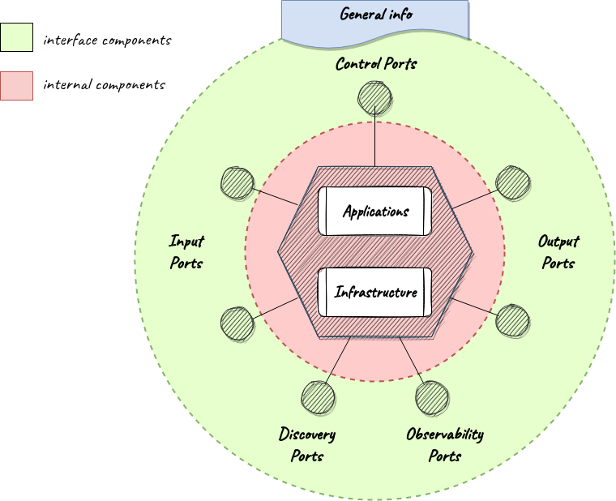
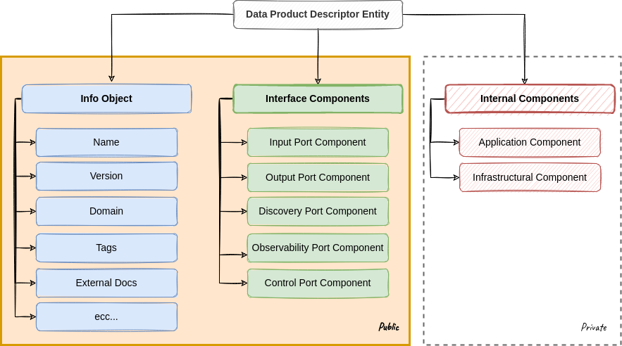
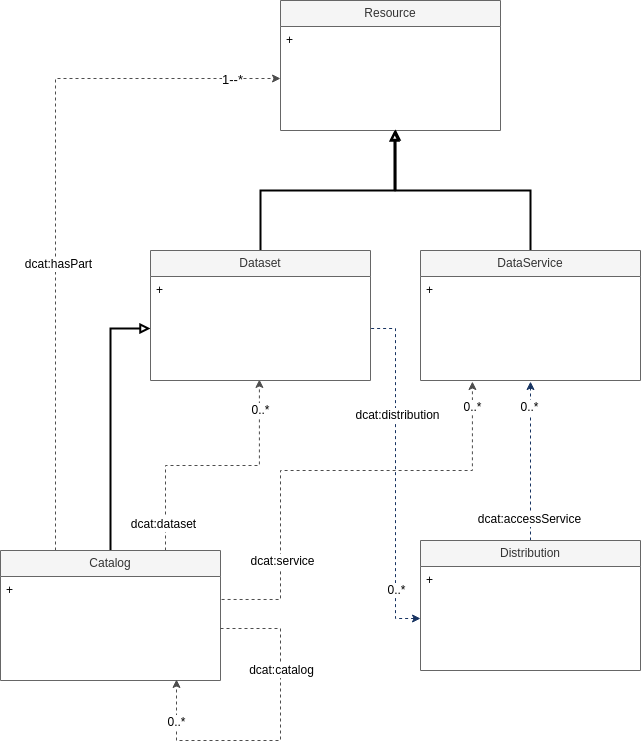
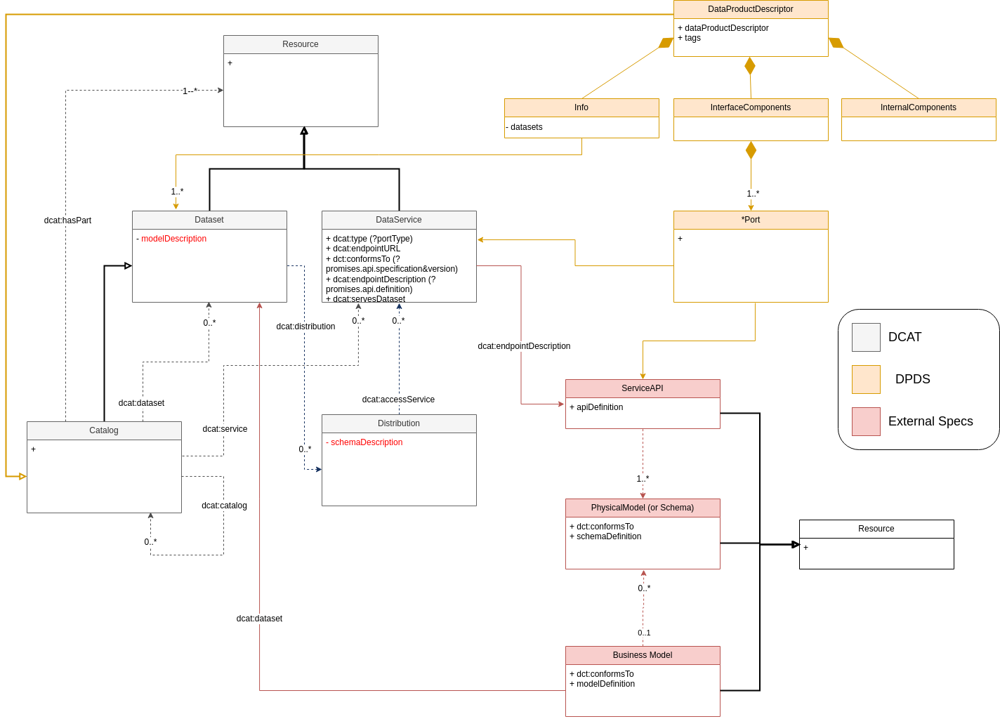

# Concepts

## Data mesh concepts

### Data Product
It's the smallest unit that can be independently deployed and managed in a data architecture (i.e. [architectural quantum](https://martinfowler.com/articles/data-mesh-principles.html#LogicalArchitecturedataProductTheArchitecturalQuantum)). It is composed of all the structural components that it requires to do its function: the metadata, the data, the code, the policies that govern the data and its dependencies on infrastructure. Each data product has a clear identifier, a version number and an owner.

Aside from general information, a data product is composed of external interfaces (i.e. interface components) and internal resources (i.e. internal components). Interface components are public and are used by external agents to access services exposed by the data product. Internal components are private and are used by the underlying DataOps Platform to deploy and operate the data product.

Note: In data mesh a data product is not just a dataset or collection of datasets. It can be seen as a microservice whose primary objective is to provide access to data rather than business functions.

### Data Product's Interface Components
External consumers interact with a data product through its public interfaces. These interfaces are grouped by functional role in entities named ports. Each port exposes a service or set of correlated services. These are the five types of ports usially exposed by a data product:

- **Input port(s):** an input port describes a set of services exposed by a data product to collect its source data and makes it available for further internal transformation. An input port can receive data from one or more upstream sources in a push (i.e. asynchronous subscription) or pop mode (i.e. synchronous query). Each data product may have one or more input ports.
- **Output port(s):** an output port describes a set of services exposed by a data product to share the generated data in a way that can be understood and trusted. Each data product may have one or more output ports.
- **Discovery port(s):** a discovery port describes a set of services exposed by a data product to provide information about its static role in the overall architecture like purpose, structure, location, etc. Each data product may have one or multiple discovery ports.
- **Observability port(s):** an observability port describes a set of services exposed by a data product to provide information about its dynamic behavior in the overall architecture like logs, traces, audit trails, metrics, etc. Each data product may have one or more observability ports.
- **Control port(s):** a control port describes a set of services exposed by a data product to configure local policies or perform highly privileged governance operations. Each data product may have one or more control ports.

### Data Product's Internal Components

A data product consists of the following internal components:

- **Application Components:** The components of a data product that implement the services exposed through its ports (i.e. pipelines, microservices, etc..).
- **Infrastructural Components**
The components of a data product related to the infrastructural resources (i.e. storage, computing, etc..) used to run its application components.

These components are not visible to its consumers. They are used by the underlying platform to automate the data producs lifecycle from cretaion to retirement.

## Data product descriptor specification (DPDS)

It's the document that serves as an entry to all the information about a data product, including its fully qualified name, owner, domain, version, interface components and internal components. It is used to share a complete view of the data product between consumers and the underlying DataOps Platform throughout its lifecycle. The objective of DPDS is to provide a standard to define the structure and content of this document.

For the time being, the activities of the working group are focused on the publicly visible part of the data product (general info and interfaces). Therefore, we will not delve further into the structure and content of the sections of the DPDS that describe the internal components.

DPDS is available [here](https://dpds.opendatamesh.org/resources/specifications/1.0.0-DRAFT/). A full example of a data product described using DPDS is available [here](https://dpds.opendatamesh.org/quickstart/).

### DPDS General Info

General info can be used to provide a high level descriptiono of the data product. Common properties of this configuration block are:

- `fullyQualifiedName` (**string:fqn**): This is the unique universal identifier of the data product.  It MUST be a URN of the form `urn:dpds:{mesh-namespace}:dataproducts:{product-name}:{product-major-version}`. It's RECOMMENDED to use as `mesh-namespace` your company's domain name in reverse dot notation (ex. `com.company-xyz`) in order to ensure that the `fullyQualifiedName` is a unique universal idetifier as REQUIRED.
- `version` (**string:version**): this is the <a href="https://semver.org/spec/v2.0.0.html" target="_blank">semantic version number</a> of the data product (not to be confused with the `dataProductDescriptor` version above).
- `domain` (**string**): This is the domain to which the data product belongs.
- `owner` ([Owner Object](https://dpds.opendatamesh.org/resources/specifications/last.md#owner-object)): This is a collection of information related to the data product's owner. The only mandatory field is the `id` of the owner, usually his or her corporate mail address.
  

### DPDS Port
All ports, regardless of their type, are described using the following fields:

- `fullyQualifiedName`: The unique universal identifier of the port. It MUST be a URN of the form `urn:dpds:{mesh-namespace}:dataproducts:{product-name}:{product-major-version}:{port-type}:{port-name}`
- `version`: This is the <a href="https://semver.org/spec/v2.0.0.html" target="_blank">semantic version number</a> of the data product's port. Every time the *major version* of port changes also the *major version* of the product MUST be incremented.
- `promises` ([Promises Object](https://dpds.opendatamesh.org/resources/specifications/last.md#promises-object)): These are the data product's promises declared over the port.  Through promises the data product declares the intent of the port. Promises are not a guarantee of the outcome but the data product will behave accordingly to them to realize its intent. The more a data product keeps its promises over time and the more trustworthy it is. Thus, the more trustworthy a data product is the more potential consumers are likely to use it. Trust is based on the verification of how good a data product was in the past in keeping its promises. This verification should be automated by the underlying platform and synthesized in a trust score shared with all potential consumers. Examples of promises are descriptions of services' API, SLO, deprecation policy, etc.
- `expectations` ([Expectations Object](https://dpds.opendatamesh.org/resources/specifications/last.md#expectations-object)): These are the data product's expectations declared over the port. Through expectations the data product declares how it wants the port to be used by its consumers. Expectations are the inverse of promises. They are a way to explicitly state what promises the data product would like consumers to make regarding how they will use the port. Examples of expectations are intended usage, intended audience, etc.
- `contracts` ([Contracts Object](https://dpds.opendatamesh.org/resources/specifications/last.md#contracts-object)): These are the data product's contracts declared over the port. Through contracts the data product declares promises and expectations that must be respected both by itself and its consumers respectively. A contract is an explicit agreement between the data product and its consumers. It is used to group all the promises and expectations that if not respected can generate penalties like monetary sanctions or interruption of service. Examples of contracts are terms of conditions, SLA, billing policy, etc.

A data product can have multiple ports of the same type, for example it is possible to have multiple output ports and/or inpunt ports.

### DPDS Port's API
The API of a port is part of its promises. The promises configuration block composed by the following fields:

- `platform`: This is the target technological platform in which the services associated with the given port operate. Examples: `onprem:milan-1`, `aws:eu-south-1`, `aws:eu-south-1:redshift`.
- `servicesType`: This is the type of service associated with the given port. Examples: `soap-services`, `rest-services`, `odata-services`,`streaming-services`, `datastore-services`.
- `api` ([Standard Definition Object](https://dpds.opendatamesh.org/resources/specifications/last.md#standardDefinitionObject)): this is the formal description of services API. A good API standard specification should describe how to define the following elements of the service interface: addressable endpoints, available authentication methods and schema of data object exchanged.
	- `specification`: This is the name of the specification used to define the service API. It is RECOMMENDED to use [Open API Specification](https://github.com/OAI/OpenAPI-Specification) for restful services, [Async API Specification](https://github.com/asyncapi/spec) for streaming services and *DataStore API Specification* for data store connection-based services. Other specifications MAY be used as required.
	- `version`: This is the version of the specification used to define the service API.
	- `definition`: This is the definition of the service API built using the specification reported in the fields above. Define how to describe the API is out of the scope of DPDS.
- `depreceationPolicy` ([Specification Extension Point](https://dpds.opendatamesh.org/resources/specifications/last.md#specificationExtensionPoint)): This is the deprecation policy adopted for the given set of services. A policy description and a pointer to external documentation can be provided. Moreover, other fields with **"x-" prefix** can be added to provide further informations as needed (ex. `x-deprecation-period`).
	- `description`: This is a general description of the deprecation policy.
	- `externalDocs` ([External Resource Object](https://dpds.opendatamesh.org/resources/specifications/last.md#externalResourceObject)): This is a pointer to external documentation that describe in more detail the deprecation policy.
- `slo`: ([Specification Extension Point](https://dpds.opendatamesh.org/resources/specifications/last.md#specificationExtensionPoint)): These are the _service_ level objectives (SLO)* supported by the given set of services. An SLO description and a pointer to external documentation can be provided. Moreover, other fields with **"x-" prefix** can be added to provide further information as needed (ex. `x-availability`, `x-responsetime`, etc...).
	- `description`: This is a general description of the supported SLO
	- `externalDocs` ([External Resource Object](https://dpds.opendatamesh.org/resources/specifications/last.md#externalResourceObject)): This is a pointer to external documentation that describes in more detail the supported SLO.

NOTE: The schema of exposed data is part of the the API description. The way of defining schema is so dependant by the API Specification Standard used. Popular standards like OpenAPI and AsyncAPI let user free to define the schema selecting the modality that best fit the format used to expose data (ex. avro schema for avro format, json schema for json, ecc ...)

## Data Catalog Vocabulary (DCAT)
DCAT is an RDF vocabulary designed to facilitate interoperability between data catalogs published on the Web. In DCAT a `catalog` is a `dataset` in which each individual item is a metadata record describing some `resource`.

A `resource` in DCAT is something that can be cataloged. DCAT defines two main types of catalogable resources: `dataset` and `data service`. Since a catalog is  a dataset, catalogs can also be cataloged. This modification introduced in version 2 of DCAT facilitates the consumption and aggregation of metadata from multiple catalogs. It also makes it possible to have a decentralized approach to publishing data catalogs and makes federated search for datasets across catalogs in multiple sites possible using the same query mechanism and structure.

A `dataset` in DCAT is defined as a "collection of data, published or curated by a single agent, and available for access or download in one or more serializations or formats". A dataset is a conceptual entity, and can be represented by one or more `distributions` that serialize the dataset for transfer. Distributions of a dataset can be provided via `data services`.

A `data service` in DCAT is a collection of operations or API which provides access to data. An interactive user-interface is often available to provide convenient access to API operations, but its description is outside the scope of DCAT.

NOTE: The `distribution` does not contains the definition of the schema of exposed data. Schema anyway is usually a part of the API definition (see `data service`). The same consideartions made for DPDS apply here.

## DPDS and DCAT mappings

DCAT lacks the concept of data product. However, the concept of data product can be associated with existing concepts in DCAT. In particular, the following are the possible mappings:

- **Data Product => Resource** A data product can be seen as a specific type of catalogable resource, just like a dataset and a data service.
- **Data Product => Dataset:** A data product can be seen as a specific type of dataset. However, this association is limiting because in the data mesh approach, a data product is a richer entity than just the exposed data. Additionally, a data product may expose multiple datasets.
- **Data Product => Catalog:** A data product can be seen as a catalog that exposes the resources it is composed of. Initially, its datasets and data services, and in the future, even its internal components (infrastructure and applications). This is certainly the preferable option.

The DCAT concept of **data service** naturally maps to the DPDS concept of **ports**

In DPDS there is not the concept of dataset and distribution. Both concepts can be inferred from output ports definition. In future versions of the specification an explicit definition of datasets exposed by a data product can be addedd to the `general info` configuration block. 

In DPDS a data product descriptor is not a data product but a version of e data product. One data product can have multiple versions. The concept of resource versioning is missing in DCAT-2. It will be added in DCAT-3.

## DPDS and DCAT integration ideas (tobe discussed...)

We can consider to define A *DCAT profile* to add to the basic specification the concepts that are important to rapresent a semantic data product and that are now missing (ex. `data product`). A DCAT profile is a specification for a data catalog that adds additional concepts and constraints to DCAT. 

Once the new profile will be in place a data product defined using DPDS will be easly transpilled into a product defined in DCAT. Transplling can be performed by each data product through one of its `discoverability ports`. The implementation of the transpilling procedure can be delegated by the data product to a sidecar library. Subsequently, the underlying platform can utilize the DCAT definition exposed by the discoverability port of each known product to construct a shared catalog encompassing all the resources that constitute the data mesh.

While this approach is valuable, it does not fully constitute a genuine data marketplace. In fact, potential consumers primarily search for business concepts rather than specifically looking for data products, APIs, or schemas. Their initial focus is on identifying the desired business concepts, and only afterwards do they seek data products that expose those concepts. At this stage, consumers can choose which product(s) they want to consume based on their preferences for APIs, exposed schemas, and declared SLO/SLA (Service Level Objectives/Agreements). Currently, DPDS lacks a concept similar to a dataset, and the dataset concept in DCAT is somewhat limited. It merely represents a resource with a small set of additional properties that describe the scope of the exposed data. I believe that a semantic data product should expand upon this concept to provide a semantic description of the exposed data, linking the physical schema with the corporate ontology or semantic graph. The overall idea is to distribute data generation and processing across data products to enhance scalability while centralizing semantic modeling to ensure order and interoperability.

