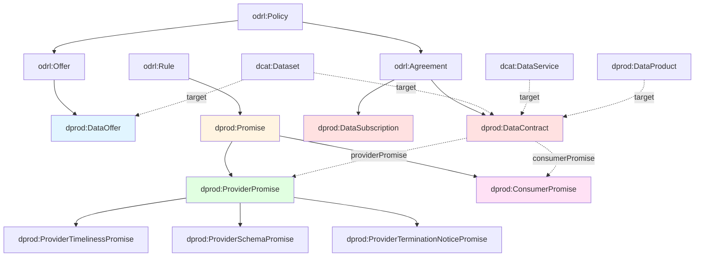
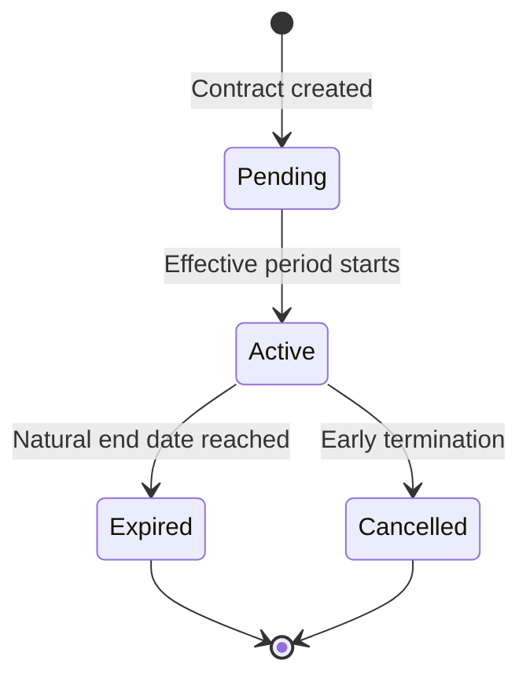

# DPROD Data Contracts Extension

## Overview

**Data Contracts** are formal agreements between data providers and consumers that specify commitments about data quality, delivery schedules, schemas, and usage restrictions. The DPROD Data Contracts extension builds on [ODRL (Open Digital Rights Language)](https://www.w3.org/TR/odrl-model/) to create machine-readable, enforceable agreements for internal organizational data sharing.

### What is a Data Contract?

A data contract is a bilateral agreement between two parties:
- **Provider** (assigner): The team or system that produces and delivers the data
- **Consumer** (assignee): The team or system that receives and uses the data

Unlike legal contracts, data contracts focus on **technical commitments**:
- When will data be delivered? (timeliness)
- What schema must the data conform to? (structure)
- How will changes be communicated? (governance)
- How may the data be used? (restrictions)

### Why Data Contracts?

Data contracts address common organizational challenges:

| Problem | Contract Solution |
|---------|------------------|
| "The daily report is late again" | **Timeliness Promise** with delivery schedule |
| "They changed the schema and broke our pipeline" | **Schema Promise** with SHACL validation + change notification |
| "We can't use this data for compliance reasons" | **Usage Restrictions** with consumer promises |
| "No one told us they were deprecating this API" | **Termination Notice Promise** with notice period |

### How DPROD Implements Data Contracts

DPROD extends ODRL with:

1. **Promise-based commitments**: Providers make promises to deliver quality data; consumers make promises about appropriate use
2. **Temporal modeling**: Schedules (iCalendar RRULE), effective periods, notice periods
3. **Schema integration**: Links to SHACL shapes, OWL ontologies, or industry standards
4. **Lifecycle management**: Contract status (Pending → Active → Expired/Cancelled)
5. **Provenance tracking**: How contracts derive from offers and evolve over time

---

## Quick Start: Core Pattern

### Simple Example (JSON-LD)

Here's a minimal data contract showing the essential pattern:

```json
{
  "@context": {
    "dprod": "https://ekgf.github.io/dprod/",
    "dcat": "http://www.w3.org/ns/dcat#",
    "odrl": "http://www.w3.org/ns/odrl/2/",
    "xsd": "http://www.w3.org/2001/XMLSchema#"
  },
  "@id": "https://example.com/contract/daily-sales",
  "@type": "dprod:DataContract",

  "odrl:assigner": {
    "@id": "https://example.com/team/sales-ops",
    "rdfs:label": "Sales Operations Team"
  },

  "odrl:assignee": {
    "@id": "https://example.com/team/finance",
    "rdfs:label": "Finance Team"
  },

  "odrl:target": {
    "@id": "https://example.com/dataset/daily-sales",
    "@type": "dcat:Dataset",
    "rdfs:label": "Daily Sales Dataset"
  },

  "dprod:providerPromise": {
    "@type": "dprod:ProviderTimelinessPromise",
    "rdfs:label": "Deliver by 8am daily",
    "odrl:action": "dprod:fulfill",
    "dprod:hasSchedule": {
      "@type": "dprod:ICalSchedule",
      "dprod:icalRule": "FREQ=DAILY;BYHOUR=8;BYMINUTE=0"
    }
  },

  "dprod:contractStatus": "dprod:ContractStatusActive",

  "dprod:hasEffectivePeriod": {
    "@type": "time:Interval",
    "time:hasBeginning": "2025-01-01T00:00:00Z",
    "time:hasEnd": "2025-12-31T23:59:59Z"
  }
}
```

**What this says:**
- Sales Ops promises to deliver the daily sales dataset to Finance
- Delivery happens daily at 8am UTC
- The contract is active for calendar year 2025

---

## Architecture Overview

### Class Hierarchy (Mermaid Diagram)



### Key Relationships

| From | Property | To | Meaning |
|------|----------|-----|---------|
| DataContract | `odrl:assigner` | Party | Who provides the data |
| DataContract | `odrl:assignee` | Party | Who consumes the data |
| DataContract | `odrl:target` | Dataset/DataService | What data is governed |
| DataContract | `dprod:providerPromise` | ProviderPromise | Provider's commitments |
| DataContract | `dprod:consumerPromise` | ConsumerPromise | Consumer's obligations |
| ProviderSchemaPromise | `dprod:requiresConformanceTo` | SHACL Shape | Required schema |
| ProviderTimelinessPromise | `dprod:hasSchedule` | Schedule | Delivery schedule |

---

## Main Classes

### dprod:DataContract

**Definition**: A bilateral agreement between a data provider and consumer specifying mutual commitments.

**Extends**: `odrl:Agreement`, `prov:Entity`

**Required Properties**:
- `odrl:assigner` — The provider party
- `odrl:assignee` — The consumer party
- `odrl:target` — The governed data asset (Dataset, DataService, or DataProduct)

**Common Properties**:
- `dprod:providerPromise` — Provider commitments (1 or more)
- `dprod:consumerPromise` — Consumer obligations (0 or more)
- `dprod:hasEffectivePeriod` — When the contract is valid (`time:Interval`)
- `dprod:contractStatus` — Lifecycle status (Pending, Active, Expired, Cancelled)
- `dcat:version` — Contract version number
- `dprod:supersedes` — Previous contract this replaces
- `dprod:amends` — Base contract this extends

**Example**:
```json
{
  "@id": "https://example.com/contract/ml-training-2025",
  "@type": "dprod:DataContract",
  "odrl:assigner": "https://example.com/team/data-eng",
  "odrl:assignee": "https://example.com/team/ml-ops",
  "odrl:target": "https://example.com/dataset/clickstream",
  "dprod:providerPromise": [
    { "@id": "#schema-freeze" },
    { "@id": "#daily-8am" }
  ],
  "dprod:contractStatus": "dprod:ContractStatusActive"
}
```

---

### dprod:ProviderPromise

**Definition**: A commitment made by the data provider about quality, timeliness, or governance.

**Extends**: `odrl:Rule` (disjoint with Duty, Permission, Prohibition)

**Required Properties**:
- `odrl:action` — Must be `dprod:fulfill`

**Subclasses**:
- `dprod:ProviderTimelinessPromise` — Delivery schedule commitments
- `dprod:ProviderSchemaPromise` — Schema conformance guarantees
- `dprod:ProviderTerminationNoticePromise` — Advance notice of changes/termination

---

### dprod:ProviderTimelinessPromise

**Definition**: Promise about when data will be delivered or updated.

**Key Property**:
- `dprod:hasSchedule` — Schedule object (iCalendar RRULE or schema.org Schedule)

**Example**:
```json
{
  "@type": "dprod:ProviderTimelinessPromise",
  "rdfs:label": "Hourly refresh",
  "odrl:action": "dprod:fulfill",
  "dprod:hasSchedule": {
    "@type": "dprod:ICalSchedule",
    "dprod:icalRule": "FREQ=HOURLY;INTERVAL=1"
  }
}
```

**Common Schedules**:
- Daily at 6am: `FREQ=DAILY;BYHOUR=6;BYMINUTE=0`
- Every 5 minutes: `FREQ=MINUTELY;INTERVAL=5`
- Weekly on Monday: `FREQ=WEEKLY;BYDAY=MO`
- Quarterly: Use `schema:Schedule` with `schema:repeatFrequency "P3M"`

---

### dprod:ProviderSchemaPromise

**Definition**: Promise that data will conform to a specified schema or standard.

**Key Properties**:
- `odrl:target` — The specific dataset this promise applies to
- `dprod:requiresConformanceTo` — The schema (SHACL shape, OWL ontology, or industry standard)

**Example**:
```json
{
  "@type": "dprod:ProviderSchemaPromise",
  "rdfs:label": "Customer schema stability",
  "odrl:action": "dprod:fulfill",
  "odrl:target": "https://example.com/dataset/customers",
  "dprod:requiresConformanceTo": {
    "@id": "https://example.com/shape/customer-v2",
    "@type": ["sh:NodeShape", "dct:Standard"],
    "rdfs:label": "Customer Schema V2"
  }
}
```

This pattern enables **automated validation**: the provider can validate data against the SHACL shape before delivery, ensuring contract compliance.

---

### dprod:ProviderTerminationNoticePromise

**Definition**: Promise to give advance notice before terminating a contract or introducing breaking changes.

**Key Properties**:
- `odrl:action` — Must be `dprod:issueNotice`
- `dprod:noticePeriod` — Required lead time (`time:Interval`)

**Example**:
```json
{
  "@type": "dprod:ProviderTerminationNoticePromise",
  "rdfs:label": "90-day change notice",
  "odrl:action": "dprod:issueNotice",
  "dprod:noticePeriod": {
    "@type": "time:Interval",
    "rdfs:comment": "90 days advance notice required"
  }
}
```

This prevents surprise breaking changes that disrupt downstream consumers.

---

### dprod:ConsumerPromise

**Definition**: A commitment made by the data consumer about how they will use the data.

**Required Properties**:
- `odrl:action` — Typically `dprod:performCompliantUse`

**Example**:
```json
{
  "@type": "dprod:ConsumerPromise",
  "rdfs:label": "Marketing use only",
  "rdfs:comment": "Data may only be used for campaign targeting, not credit decisions",
  "odrl:action": "dprod:performCompliantUse"
}
```

Common consumer promises:
- **Usage restrictions**: "Only for fraud detection, not marketing"
- **Retention policies**: "Delete after 90 days per GDPR"
- **Rate limits**: "Max 1000 API calls per minute"
- **Access controls**: "Provide read-only access to external auditors"

---

## Usage Patterns

### Pattern 1: Schema Validation Guarantee

**Scenario**: Data Engineering promises ML team that clickstream data will conform to a stable schema for the entire year.

**Contract** (simplified):
```json
{
  "@context": {
    "dprod": "https://ekgf.github.io/dprod/",
    "dcat": "http://www.w3.org/ns/dcat#",
    "odrl": "http://www.w3.org/ns/odrl/2/",
    "sh": "http://www.w3.org/ns/shacl#",
    "xsd": "http://www.w3.org/2001/XMLSchema#"
  },

  "@id": "https://example.com/contract/ml-clickstream-2025",
  "@type": "dprod:DataContract",

  "rdfs:label": "ML Training Clickstream Contract 2025",

  "odrl:assigner": {
    "@id": "https://example.com/team/data-eng",
    "rdfs:label": "Data Engineering"
  },

  "odrl:assignee": {
    "@id": "https://example.com/team/ml-ops",
    "rdfs:label": "ML Operations"
  },

  "odrl:target": {
    "@id": "https://example.com/dataset/clickstream-training",
    "@type": "dcat:Dataset",
    "dcat:title": "Clickstream Training Dataset"
  },

  "dprod:providerPromise": {
    "@type": "dprod:ProviderSchemaPromise",
    "rdfs:label": "Schema Freeze for 2025",
    "rdfs:comment": "No breaking changes to ClickStreamV2 schema during 2025",
    "odrl:action": "dprod:fulfill",
    "odrl:target": "https://example.com/dataset/clickstream-training",

    "dprod:requiresConformanceTo": {
      "@id": "https://example.com/shape/clickstream-v2",
      "@type": ["sh:NodeShape", "dct:Standard"],
      "rdfs:label": "ClickStream V2 Schema",

      "sh:property": [
        {
          "sh:path": "ex:userId",
          "sh:datatype": "xsd:string",
          "sh:minCount": 1,
          "sh:pattern": "^[a-f0-9]{64}$",
          "rdfs:comment": "SHA-256 hashed user ID"
        },
        {
          "sh:path": "ex:timestamp",
          "sh:datatype": "xsd:dateTime",
          "sh:minCount": 1
        },
        {
          "sh:path": "ex:eventType",
          "sh:datatype": "xsd:string",
          "sh:in": ["page_view", "click", "purchase"]
        }
      ]
    }
  },

  "dprod:hasEffectivePeriod": {
    "@type": "time:Interval",
    "time:hasBeginning": "2025-01-01T00:00:00Z",
    "time:hasEnd": "2025-12-31T23:59:59Z"
  },

  "dprod:contractStatus": "dprod:ContractStatusActive"
}
```

**Value**: ML team can train models knowing the schema won't change mid-year and break production pipelines.

---

### Pattern 2: Timeliness with Daily Schedule

**Scenario**: Finance promises Marketing that customer segmentation data will refresh daily at 6am UTC.

**Contract** (simplified):
```json
{
  "@context": {
    "dprod": "https://ekgf.github.io/dprod/",
    "dcat": "http://www.w3.org/ns/dcat#",
    "odrl": "http://www.w3.org/ns/odrl/2/"
  },

  "@id": "https://example.com/contract/customer-segments-2025",
  "@type": "dprod:DataContract",

  "rdfs:label": "Customer Segmentation Contract",

  "odrl:assigner": "https://example.com/dept/finance",
  "odrl:assignee": "https://example.com/dept/marketing",
  "odrl:target": "https://example.com/dataset/customer-segments",

  "dprod:providerPromise": [
    {
      "@type": "dprod:ProviderTimelinessPromise",
      "rdfs:label": "Daily 6am refresh",
      "odrl:action": "dprod:fulfill",
      "dprod:hasSchedule": {
        "@type": "dprod:ICalSchedule",
        "dprod:icalRule": "FREQ=DAILY;BYHOUR=6;BYMINUTE=0",
        "rdfs:comment": "Daily at 06:00 UTC"
      }
    },
    {
      "@type": "dprod:ProviderSchemaPromise",
      "rdfs:label": "Segment schema guarantee",
      "odrl:action": "dprod:fulfill",
      "odrl:target": "https://example.com/dataset/customer-segments",
      "dprod:requiresConformanceTo": "https://example.com/shape/customer-segment"
    }
  ],

  "dprod:consumerPromise": {
    "@type": "dprod:ConsumerPromise",
    "rdfs:label": "Campaign use only",
    "rdfs:comment": "Marketing may only use for campaign targeting, not credit decisions",
    "odrl:action": "dprod:performCompliantUse"
  }
}
```

**Value**: Marketing knows exactly when data arrives for their 9am campaign launches. Finance commits to not changing the schema without notice.

---

### Pattern 3: Privacy-Safe Data with Validation

**Scenario**: Product Analytics promises Personalization team that user behavior data will be privacy-safe (PII removed, GDPR-compliant).

**Contract** (simplified):
```json
{
  "@context": {
    "dprod": "https://ekgf.github.io/dprod/",
    "dcat": "http://www.w3.org/ns/dcat#",
    "odrl": "http://www.w3.org/ns/odrl/2/",
    "sh": "http://www.w3.org/ns/shacl#"
  },

  "@id": "https://example.com/contract/user-behavior-personalization",
  "@type": "dprod:DataContract",

  "odrl:assigner": "https://example.com/team/product-analytics",
  "odrl:assignee": "https://example.com/team/personalization",
  "odrl:target": "https://example.com/dataset/user-events",

  "dprod:providerPromise": {
    "@type": "dprod:ProviderSchemaPromise",
    "rdfs:label": "Privacy-safe events",
    "rdfs:comment": "All PII removed before delivery - safe for ML use",
    "odrl:action": "dprod:fulfill",
    "odrl:target": "https://example.com/dataset/user-events",

    "dprod:requiresConformanceTo": {
      "@id": "https://example.com/shape/privacy-compliant-events",
      "@type": ["sh:NodeShape", "dct:Standard"],
      "rdfs:label": "Privacy-Compliant Events Shape",
      "rdfs:comment": "Enforces PII removal via SHACL validation",

      "sh:property": [
        {
          "sh:path": "ex:userId",
          "sh:pattern": "^[a-f0-9]{64}$",
          "rdfs:comment": "Must be SHA-256 hash, not plaintext"
        },
        {
          "sh:path": "ex:eventType",
          "sh:in": ["page_view", "product_click", "add_to_cart"]
        }
      ],

      "sh:not": [
        { "sh:path": "ex:email" },
        { "sh:path": "ex:ipAddress" },
        { "sh:path": "ex:phoneNumber" }
      ],

      "rdfs:comment": "Validation fails if email, IP, or phone present - acts as privacy firewall"
    }
  },

  "dprod:consumerPromise": {
    "@type": "dprod:ConsumerPromise",
    "rdfs:label": "GDPR deletion compliance",
    "rdfs:comment": "Honor deletion requests within 30 days, retrain models without deleted users",
    "odrl:action": "dprod:performCompliantUse"
  }
}
```

**Value**: The SHACL shape acts as a **privacy firewall** — data fails validation if PII leaks through. Personalization team can use the data confidently for ML.

---

### Pattern 4: Change Notification with Termination Notice

**Scenario**: Sales Ops provides API access to Customer Success team with a 90-day notice requirement before breaking changes.

**Contract** (simplified):
```json
{
  "@context": {
    "dprod": "https://ekgf.github.io/dprod/",
    "dcat": "http://www.w3.org/ns/dcat#",
    "odrl": "http://www.w3.org/ns/odrl/2/"
  },

  "@id": "https://example.com/contract/customer-account-api",
  "@type": "dprod:DataContract",

  "odrl:assigner": "https://example.com/team/sales-ops",
  "odrl:assignee": "https://example.com/team/customer-success",

  "odrl:target": {
    "@id": "https://example.com/service/customer-account-api",
    "@type": "dcat:DataService",
    "dcat:title": "Customer Account API v2"
  },

  "dprod:providerPromise": [
    {
      "@type": "dprod:ProviderSchemaPromise",
      "rdfs:label": "API v2 stability",
      "rdfs:comment": "API follows semantic versioning - v2 stays stable",
      "odrl:action": "dprod:fulfill",
      "odrl:target": "https://example.com/service/customer-account-api",
      "dprod:requiresConformanceTo": "https://example.com/spec/customer-api-v2-openapi"
    },
    {
      "@type": "dprod:ProviderTerminationNoticePromise",
      "rdfs:label": "90-day deprecation notice",
      "odrl:action": "dprod:issueNotice",
      "dprod:noticePeriod": {
        "@type": "time:Interval",
        "rdfs:comment": "Minimum 90 days notice before v2 deprecation or breaking changes"
      }
    }
  ],

  "dprod:consumerPromise": {
    "@type": "dprod:ConsumerPromise",
    "rdfs:label": "Rate limit compliance",
    "rdfs:comment": "Max 1000 requests/minute - enforced by API gateway",
    "odrl:action": "dprod:performCompliantUse"
  }
}
```

**Value**: Customer Success team can build integrations confidently knowing they'll get 90 days to migrate before v3 or breaking changes.

---

## Contract Lifecycle

Contracts progress through statuses:



**Status Vocabulary** (`dprod:ContractStatus`):
- `dprod:ContractStatusPending` — Negotiation or awaiting effective date
- `dprod:ContractStatusActive` — Currently in force
- `dprod:ContractStatusExpired` — Reached natural end date
- `dprod:ContractStatusCancelled` — Terminated before planned end

**Contract Versioning**:
- `dprod:supersedes` — This contract replaces a previous version (old becomes Expired/Cancelled)
- `dprod:amends` — This contract extends/modifies a base contract (both remain Active)

**Example** (renewal):
```json
{
  "@id": "https://example.com/contract/2025-renewal",
  "@type": "dprod:DataContract",
  "dprod:supersedes": "https://example.com/contract/2024",
  "dcat:version": "2.0",
  "rdfs:comment": "2025 renewal with updated SLAs"
}
```

---

## Integration with DPROD Data Products

Data contracts naturally integrate with DPROD Data Products:

```json
{
  "@id": "https://example.com/product/customer-360",
  "@type": "dprod:DataProduct",
  "dcat:title": "Customer 360 Data Product",

  "odrl:hasPolicy": {
    "@id": "https://example.com/offer/customer-360-standard",
    "@type": "dprod:DataOffer",
    "rdfs:comment": "Standing offer - anyone can request access"
  },

  "dprod:dataContract": [
    {
      "@id": "https://example.com/contract/finance-customer-360",
      "@type": "dprod:DataContract",
      "odrl:assignee": "https://example.com/dept/finance",
      "rdfs:comment": "Finance's active contract"
    },
    {
      "@id": "https://example.com/contract/marketing-customer-360",
      "@type": "dprod:DataContract",
      "odrl:assignee": "https://example.com/dept/marketing",
      "rdfs:comment": "Marketing's active contract"
    }
  ]
}
```

This allows a single data product to have:
- **One offer** (the standard terms available to anyone)
- **Many contracts** (executed agreements with specific consumers)

---

## Best Practices

### 1. Start Simple
Begin with minimal contracts containing just timeliness or schema promises. Add complexity as needed.

### 2. Make Schemas Machine-Readable
Use SHACL shapes (not just comments) so providers can validate data before delivery:
```bash
# Validate data before delivery
pyshacl --shacl customer-shape.ttl --data-file daily-export.ttl
```

### 3. Use iCalendar for Schedules
[RFC 5545 RRULE](https://icalendar.org/iCalendar-RFC-5545/3-3-10-recurrence-rule.html) is widely supported:
- Libraries: Python `dateutil.rrule`, JavaScript `rrule.js`
- Clear semantics: `FREQ=DAILY;BYHOUR=8` is unambiguous

### 4. Version Your Contracts
Use `dcat:version` and provenance properties (`supersedes`, `amends`) to track evolution.

### 5. Automate Monitoring
Build monitors that check:
- Is data arriving on schedule? (timeliness promise)
- Does data validate against the shape? (schema promise)
- Are notice periods being honored? (termination promise)

### 6. Link to Governance
Embed contracts in your data catalog (DCAT) and governance tools. Contracts are *metadata* that should be discoverable.

---

## Namespace Declarations

For JSON-LD contexts:

```json
{
  "@context": {
    "dprod": "https://ekgf.github.io/dprod/",
    "dcat": "http://www.w3.org/ns/dcat#",
    "dct": "http://purl.org/dc/terms/",
    "odrl": "http://www.w3.org/ns/odrl/2/",
    "prov": "http://www.w3.org/ns/prov#",
    "skos": "http://www.w3.org/2004/02/skos/core#",
    "rdfs": "http://www.w3.org/2000/01/rdf-schema#",
    "xsd": "http://www.w3.org/2001/XMLSchema#",
    "time": "http://www.w3.org/2006/time#",
    "sh": "http://www.w3.org/ns/shacl#",
    "schema": "http://schema.org/"
  }
}
```

For Turtle:
```turtle
@prefix dprod:  <https://ekgf.github.io/dprod/> .
@prefix dcat:   <http://www.w3.org/ns/dcat#> .
@prefix dct:    <http://purl.org/dc/terms/> .
@prefix odrl:   <http://www.w3.org/ns/odrl/2/> .
@prefix prov:   <http://www.w3.org/ns/prov#> .
@prefix time:   <http://www.w3.org/2006/time#> .
@prefix sh:     <http://www.w3.org/ns/shacl#> .
```

---

## Further Reading

- **ODRL Information Model**: https://www.w3.org/TR/odrl-model/
- **DCAT3 Specification**: https://www.w3.org/TR/vocab-dcat-3/
- **SHACL**: https://www.w3.org/TR/shacl/
- **PROV-O**: https://www.w3.org/TR/prov-o/
- **iCalendar RRULE**: https://icalendar.org/iCalendar-RFC-5545/3-3-10-recurrence-rule.html
- **DPROD Specification**: https://ekgf.github.io/dprod/

---

## Appendix: Complete Example

See [`dprod-contract-examples.ttl`](./dprod-contract-examples.ttl) for comprehensive Turtle examples demonstrating:
- Finance → Marketing customer segmentation contract
- Data Engineering → ML Ops training data contract
- Sales → Customer Success API access contract
- Accounting → Audit quarterly SOX compliance contract
- Product Analytics → Personalization privacy-safe events contract
- Contract lifecycle and versioning patterns
